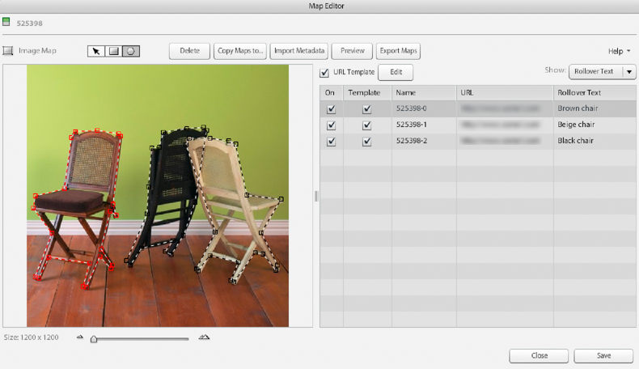

# Imagemaps erstellen {#creating-image-maps}

Eine Imagemap ist ein Bereich auf einem Bild, einer E-Katalog-Seite oder einem Bild in einem Rotationsset, das ein Rollover-Bedienfeld mit Text anzeigt. Wenn der/die Benutzende eine Imagemap auswählt, wird eine Aktion irgendeiner Art ausgelöst. Beispielsweise wird eine Web-Seite gestartet, auf der Benutzende mehr über ein Produkt erfahren können. Um eine Imagemap wird ein Umriss angezeigt, wenn der Benutzer den Mauszeiger darüber bewegt.

Neben der Möglichkeit, Imagemaps in Adobe Dynamic Media Classic zu erstellen, können Sie beim Entwerfen eines Katalogs in Adobe Acrobat oder Adobe InDesign auch Imagemaps erstellen.

Beim Erstellen von Imagemaps haben Sie folgende Möglichkeiten:

* Rollover-Text eingeben
* Geben Sie JavaScript und URLs für den Start von Web-Seiten ein.
* URL-Vorlagen für Imagemaps erstellen
* Imagemaps in andere Bilder, E-Katalogseiten oder Rotationssets kopieren
* Imagemaps in CSV- oder XML-Dateien exportieren
* Importieren Sie Bildmetadaten aus einer tabulatorgetrennten Datei oder aus einer XML-Datei.
* Definition anderer vom World Wide Web Consortium festgelegter Aktionen.
* Vorschau der Imagemaps anzeigen

## Zeichnen und Anpassen einer Imagemap {#drawing-and-adjusting-an-image-map}

1. Führen Sie einen der folgenden Schritte aus:

   * Wenn Sie mit einem Bild in der Rasteransicht oder Listenansicht arbeiten, wählen Sie in der Dropdown-Liste Bearbeiten die Option **[!UICONTROL Imagemap]** aus. Oder öffnen Sie es in der Detailansicht und wählen Sie dann **[!UICONTROL Imagemap]** über dem Bild aus.
   * Wenn Sie mit einem Rotationsset in der Rasteransicht oder Listenansicht arbeiten, wählen Sie **[!UICONTROL Bearbeiten]**. Oder öffnen Sie es in der Detailansicht und wählen Sie dann **[!UICONTROL Bearbeiten]** aus. Wählen Sie ein Bild-Asset aus und klicken Sie auf **[!UICONTROL Imagemap]**.
   * Wenn Sie mit einem E-Katalog arbeiten, wählen Sie in der Rasteransicht, Listenansicht, Detailansicht die Option **[!UICONTROL Bearbeiten]**. Wählen Sie die **[!UICONTROL Seiten zuordnen]** aus.

   

1. Sie können eine rechteckige oder polygonale Imagemap zeichnen:

   * **Rechteckige Karte**: Wählen Sie das Rechteck-Imagemap-Werkzeug aus und ziehen Sie auf die Seite, um das Rechteck zu erstellen. Drücken Sie zum Hinzufügen eines Punkts zu einer rechteckigen Karte (und damit zu einer Polygonzuordnung) die Strg-Taste, platzieren Sie das Einfügewerkzeug an der gewünschten Position und wählen Sie.

   * **Polygonkarte**: Wählen Sie das Werkzeug Polygon-Imagemap und wählen Sie Punkte auf dem Umfang des Bereichs des Bildes aus, den Sie einschließen möchten. Verwenden Sie den Regler für die Dichte des Polygons, um die Punktdichte im Polygon zu ändern. Die ursprüngliche Dichte wird wiederhergestellt, wenn Sie andere Maps auswählen. Wenn ein Punkt im Polygon hinzugefügt, gelöscht oder verschoben wird, geht die ursprüngliche Dichte verloren. Der Schieberegler wird auf seinen Maximalwert zurückgesetzt.

1. Geben Sie optional in der Imagemap-Liste einen Namen für die Imagemap ein. Nachdem Sie eine Imagemap gezeichnet haben, weist Adobe Dynamic Media Classic ihr einen Namen zu.

   Um den Namen zu erstellen, hängt Adobe Dynamic Media Classic eine sequenzielle Nummer an den Namen des Bildes oder der E-Katalog-Seite an, mit dem bzw. der Sie arbeiten. Sie können jedoch auch einen Namen Ihrer Wahl eingeben.

1. Wenn Benutzerinnen und Benutzer eine neue Web-Seite öffnen sollen, wenn sie auf die Imagemap klicken, geben Sie die URL in die Liste „Imagemap“ ein.

   Siehe [Eingeben von JavaScript und URLs](creating-image-maps.md#using_a_template_to_enter_javascript_and_urls).

1. Wenn Rollover-Text angezeigt werden soll, sobald die Benutzer den Mauszeiger über die Imagemap bewegen, geben Sie den Text in der Imagemap-Liste ein. Wählen Sie in der Liste „Imagemap“ das Menü **[!UICONTROL Anzeigen]** und dann **[!UICONTROL Rollover-Text]** aus. Geben Sie dann den Text ein, der Benutzern auf dem Bildschirm angezeigt werden soll. Sie können den Text in einem Textverarbeitungsprogramm schreiben und in das Feld „Rollover-Text“ kopieren.

1. Sie können auch eine andere Aktion definieren, die ausgeführt werden soll, wenn die Benutzer den Mauszeiger über die Imagemap bewegen. Wählen Sie in **[!UICONTROL Dropdown]** Liste „Anzeigen“ die Option **[!UICONTROL Andere Aktionen]**. Geben Sie die Attribute der Aktion ein. (Gehen Sie zu **[!UICONTROL Anzeigen]** > **[!UICONTROL Beide]**, um Rollover-Text und eine Aktion für eine Imagemap zu erstellen.)

   Siehe [Definieren anderer Aktionen für Imagemaps](creating-image-maps.md#defining_other_actions_for_image_maps).

1. (Optional) Führen Sie dann einen der folgenden Schritte aus:

   * Um Imagemaps in der Vorschau anzuzeigen, wählen Sie **[!UICONTROL Vorschau]** aus.
   * Um eine Imagemap oder einen Polygonscheitelpunkt zu löschen, wählen Sie eine Form im Bild aus und klicken Sie dann auf **[!UICONTROL Löschen]**. Oder wählen Sie für einen E-Katalog auf der Registerkarte Bestellseiten die Option **[!UICONTROL Karten löschen]**, um Imagemaps aus allen Seiten zu entfernen.
   * So entfernen Sie ein:
      * Imagemap aus einem Bild
      * ein Bild in einem Rotationsset
      * oder eine E-Katalog-Seite

     Deaktivieren Sie vorübergehend die entsprechende Option Ein in der Imagemap-Liste, ohne sie zu löschen.

1. Wählen Sie **[!UICONTROL Speichern]** aus.

### Anpassen von Position, Form und Größe von Imagemaps {#adjusting-the-position-shape-and-size-of-image-maps}

Um die Position, Form und Größe einer Imagemap zu ändern, klicken Sie auf die Schaltfläche Imagemap . Wählen Sie anschließend das **[!UICONTROL Pan]**-Tool aus und befolgen Sie die folgenden Anweisungen:

* **Position ändern**: Bewegen Sie den Mauszeiger in die Nähe des Rahmens der Imagemap, aber nicht über diesen. Wenn der Mauszeiger als Vierfachpfeil dargestellt wird, ziehen Sie die Imagemap an eine andere Position.

* **Ändern der Größe und Form**: Wie Sie die Form und Größe einer Imagemap ändern, hängt davon ab, ob Sie mit einer rechteckigen oder polygonalen Imagemap arbeiten:

>[!TIP]
>
>Sie können den Schieberegler „Größe“ unten im Anzeigebereich ziehen, um die Ansichten zu ändern und die Imagemap besser anzeigen zu können.

* **Rechteckige Imagemap**: Bewegen Sie den Mauszeiger über eine Seite oder Ecke der Imagemap. Wenn der Mauszeiger als Doppelpfeil dargestellt wird, ziehen Sie mit der Maus. Halten Sie die Umschalttaste gedrückt, während Sie ziehen, um die Größe zu ändern, aber das Seitenverhältnis (die Form) beizubehalten.

* **Polygonale Imagemap**: Ziehen Sie einen quadratischen Auswahlpunkt. Um einen Auswahlpunkt zu erstellen, wählen Sie den Rahmen der Imagemap aus und beginnen Sie mit dem Ziehen.

### Überlappende Imagemaps behandeln {#handling-overlapping-image-maps}

Wenn Ihre Bild- oder E-Katalog-Seite mehr als eine Imagemap enthält und sich die Karten überschneiden, können Sie bestimmen, wie sich die Karten überschneiden. Ändern Sie dazu in der Imagemap-Liste die Reihenfolge der Imagemaps. Ziehen Sie die Namen zu einer höheren oder niedrigeren Position in der Liste. Die Imagemaps an höheren Positionen überlagern die Imagemaps an niedrigeren Positionen in der Liste.

### Importieren von Imagemap-Daten {#importing-image-map-data}

Anstatt auf jeder Seite Imagemap-Daten einzugeben, können Sie auch die Daten für das Bild, das Rotationsset oder den E-Katalog in den Anzeigebereich mit der Imagemap-Zusammenfassung importieren. Die Imagemap-Daten werden in Form einer tabulatorgetrennten oder XML DTD-Datei importiert. Die Felder in der Datei müssen dieselbe Reihenfolge haben, wie im Anzeigebereich mit der Imagemap-Zusammenfassung dargestellt: „Name“, „Inhaltsverz.“, „Imagemaps“, „URLs“, „Rollover-Text“, „Andere Aktionen“ und „Suchzeichenfolgen“. Durch den Import von Imagemap-Daten müssen Sie die Daten nicht erst in die Imagemap-Liste eingeben, wenn Sie jede Imagemap erstellen.

**So importieren Sie Imagemap-Daten:**

1. Gehen Sie zur Seite „Imagemap-Editor“ (für Bilder oder Bilder in Rotationssets) oder zur Registerkarte „Imagemap-Seiten“ im Bearbeitungsbildschirm für E-Kataloge.
1. Wählen Sie **[!UICONTROL Metadaten importieren]** aus.
1. Wählen Sie im Dialogfeld Metadaten hochladen die Option Bild oder Imagemap aus, um die Metadaten aus dem gewünschten Asset-Eigenschaftstyp hochzuladen.
1. Wählen Sie in der Dropdown-Liste `Generate File` den Dateityp aus, den Sie erstellen möchten.
1. (Optional) Wählen Sie **[!UICONTROL Generieren]** aus, um die resultierenden Daten basierend auf dem Dateityp, den Sie erstellen möchten, in der Vorschau anzuzeigen. Wählen Sie **[!UICONTROL Schließen]** aus, um zum Dialogfeld „Metadaten hochladen“ zurückzukehren.
1. Navigieren Sie zu der Datei, die Sie hochladen möchten. Geben Sie im Textfeld „Dateiname“ den Namen der erstellten Datei an.
1. (Optional) Geben Sie im Feld „Auftragsname“ einen Namen für den Auftrag „Metadaten hochladen“ ein.
1. Wählen Sie **[!UICONTROL Hochladen]** aus.

### Kopieren von Imagemaps {#copying-image-maps}

Sie können Imagemaps zwischen Bildern und E-Katalogseiten kopieren. Verwenden Sie **[!UICONTROL Imagemap kopieren]** um einen Vorsprung bei der Erstellung zu erhalten. Sie können auch Imagemaps kopieren, um sie in Bildern oder Seiten neu zu erstellen, die dasselbe Layout oder dieselbe Zuordnungsstruktur aufweisen.

Das Kopieren von Imagemaps in einem E-Katalog ist beispielsweise eine praktische Methode, um alle Imagemaps zwischen fremdsprachigen Versionen desselben E-Katalogs zu kopieren. Um optimale Ergebnisse zu erzielen, ist das Kopieren am erfolgreichsten, wenn Sie zwischen E-Katalogen mit derselben Seitenanzahl und denselben Bildern kopieren. Wenn der E-Katalog, in den Sie kopieren, bereits Imagemaps enthält, werden diese beim Erstellen der Kopie gelöscht.

**So kopieren Sie Imagemaps:**

1. Gehen Sie zur Seite „Imagemap-Editor“ (für Bilder oder Bilder in Rotationssets) oder zur Registerkarte „Imagemap-Seiten“ im Bearbeitungsbildschirm für E-Kataloge.
1. Wählen **[!UICONTROL Zuordnungen kopieren nach]**.
1. Führen Sie, abhängig davon, ob Sie Imagemaps aus Bildern oder Imagemaps aus einem E-Katalog kopieren möchten, einen der folgenden Schritte aus:

   * (Bilder) Wählen Sie im Bildschirm „Bilder auswählen“ die Bilder aus, die Sie in die Imagemaps kopieren möchten.
   * (E-Katalog) Wählen Sie im Bildschirm „Asset auswählen“ die Bilder oder E-Katalogseiten aus, die Sie in die Imagemaps kopieren möchten.

1. Wählen Sie **[!UICONTROL Auswählen]** aus.

## Verwenden einer Vorlage zur Eingabe von JavaScript und URLs {#using-a-template-to-enter-javascript-and-urls}

Sie können eine URL-Vorlage (auch Href-Vorlage genannt) definieren, um das Eingeben von Imagemap-URLs einfacher und effizienter zu machen. Es ist sinnvoll, eine URL-Vorlage zu definieren, wenn die meisten Ihrer Imagemap-URLs ein gemeinsames festes Format haben. Wenn Sie den gleich bleibenden Teil der URL als Vorlage definieren, brauchen Sie diesen Teil beim Erstellen einer neuen Imagemap-URL nicht jedes Mal erneut einzugeben. Ihre URL-Vorlage kann auch JavaScript-Befehle, Pfadnamen und Parameter enthalten. Standardmäßig enthält die URL-Vorlage einen proprietären Adobe Dynamic Media Classic JavaScript-Handler namens `loadProduct` , der das Bild in einem neuen Fenster öffnet.

>[!NOTE]
>
>Wenn Sie den JavaScript-Code zum HREF-Attribut Ihrer Imagemap hinzufügen, wird der Code auf dem Computer des Clients ausgeführt. Stellen Sie daher sicher, dass der JavaScript-Code sicher ist.

### URL-Vorlagen {#about-url-templates}

Die URL-Vorlage ersetzt den Inhalt der URL-Spalte in der Imagemap-Liste. Er ersetzt sie durch die doppelten Dollarzeichen (&#39;$&#39;) in der Vorlage:

```as3
Javascript:loadProduct('$$');void(0);
```

Sie platzieren alle Werte, die sich zwischen Imagemaps nicht ändern, in der URL-Vorlage. Fügen Sie anschließend nur die Werte hinzu, die sich in der Spalte „URL“ der Imagemap-Liste ändern. Beispiel:

* URL-Vorlage: `javascript:loadProduct('https://www.examplesitehere.com/$$');void(0);`
* URL-Wert: `product.htm`
* Tatsächlich generierte URL: `javascript:loadProduct('https://www.examplesitehere.com/product.html);void(0);`

Standardmäßig enthält die URL-Vorlage einen proprietären Adobe Dynamic Media Classic JavaScript-Handler namens `loadProduct` , der ein neues Fenster mit dem URL-Ziel öffnet. Sie können jedoch einen beliebigen JavaScript-Code verwenden, um diesen JavaScript-Handler zu ersetzen, oder einen der folgenden Adobe Dynamic Media Classic-Handler verwenden:

* `loadProductCW`: Zeigt das URL-Ziel an, das in der URL-Spalte im aktuellen Fenster angegeben ist. Dieser Handler ist hauptsächlich für E-Kataloge vorgesehen, die in eine Seite innerhalb einer Website integriert sind.

* `loadProductPW`: Zeigt das URL-Ziel an, das in der URL-Spalte im übergeordneten Fenster angegeben ist (die Seite, die die aktuelle geöffnet hat). Das aktuelle Fenster bleibt geöffnet, während im übergeordneten Fenster das URL-Ziel angezeigt wird.

  >[!NOTE]
  >
  >Der Handler `loadProductPW` unterstützt keine DHTML- und HTML5-Viewer.

### Erstellen einer URL-Vorlage {#creating-a-url-template}

1. Klicken Sie auf dem Bildschirm „Zuordnungs-Editor“ (Bilder oder Rotationssets) oder auf der Registerkarte „Zuordnungsseiten“ des Bildschirms „E-Katalog“ (E-Kataloge) neben der Option URL-Vorlage auf Bearbeiten . Das Dialogfeld „Verweisvorlage bearbeiten“ wird geöffnet.
1. Geben Sie den JavaScript-Code und die vollständige URL ein (wobei der variable Teil durch Dollarzeichen [$$] ersetzt wird). Sie können den Code einfügen, indem Sie mit der rechten Maustaste klicken und **[!UICONTROL Einfügen]** auswählen.
1. Wählen Sie **[!UICONTROL Speichern]** aus.

### URL-Vorlagen verarbeiten {#handling-url-templates}

Auf der Seite „Map-Editor“ (bei Bildern und Rotationssets) bzw. der Registerkarte „Imagemap-Seiten“ des Anzeigebereichs „E-Katalog“ (bei E-Katalogseiten) stehen folgende Befehle zum Einstellen von URL-Vorlagen zur Verfügung:

* **URL-Vorlagenoption**: Wählen Sie die Option URL-Vorlage aus, um Ihre URL-Vorlage auf alle Imagemaps auf einer Bild- oder E-Katalog-Seite anzuwenden.

* **Vorlagenoption**: Deaktivieren Sie in der URL-Imagemap-Liste die Option „Vorlage“, wenn keine einzelne Imagemap die URL-Vorlage verwenden soll.

## Definieren anderer Aktionen für Imagemaps {#defining-other-actions-for-image-maps}

Sie können das Menü **[!UICONTROL Anzeigen]** auswählen und **[!UICONTROL Andere Aktionen]** auswählen, um andere Trigger-Aktionen als Rollover-Text und Web-Seiten-Launches auszuführen. Wenn der Benutzer den Mauszeiger über eine Imagemap bewegt, kann die Aktion ausgelöst werden. Diese Aktionen sind Attribute, die mithilfe der HTML-Spezifikationen des W3C (World Wide Web Consortium) für clientseitige Imagemaps definiert werden. Diese umfassen Folgende:

* **`accesskey`**: Trigger führen eine Aktion aus, wenn der Benutzer eine bestimmte Taste auf der Tastatur drückt.

* **`onfocus`**: Trigger eines Ereignisses, wenn die Imagemap den Fokus erhält - durch den Cursor, durch Tabulatortaste oder durch Drücken einer Zugriffstaste. Sie können beispielsweise eine Web-Seite starten, wenn die Imagemap den Fokus erhält, und sie schließen, wenn die Imagemap den Fokus verliert.

* **`onblur`**: Trigger eines Ereignisses, wenn die Imagemap den Fokus verliert, entweder durch den Cursor oder durch Tabulatortaste.

**So definieren Sie andere Aktionen für Imagemaps:**

1. Wählen Sie auf dem Bildschirm „Karteneditor“ (Bilder und Rotationssets) oder der Registerkarte „Seiten zuordnen“ des Bildschirms „E-Katalog“ (E-Kataloge) das Menü **[!UICONTROL Anzeigen]** und wählen Sie **[!UICONTROL Weitere Aktionen]**.
1. Fügen Sie unter Verwendung der vom W3C-Konsortium spezifizierten Syntax in der Spalte „Andere Aktionen“ der Imagemap-Liste die unterstützten Attribute ein.
1. Wählen Sie **[!UICONTROL Speichern]** aus.

Wählen Sie das **[!UICONTROL Anzeigen]**-Menü aus und wählen Sie **[!UICONTROL Beide]**, wenn für eine Imagemap Rollover-Text und eine Aktion angezeigt werden sollen.

## Erstellen von Imagemaps in Adobe Acrobat oder Adobe InDesign {#creating-image-maps-in-adobe-acrobat-or-adobe-indesign}

Sie können Imagemaps während des Entwerfens Ihres E-Katalogs in Adobe Acrobat oder Adobe InDesign erstellen.

Erstellen Sie in Adobe Acrobat oder Adobe InDesign Hyperlink-Verweise, in denen die Imagemaps angezeigt werden sollen, und geben Sie URL-Speicherorte für die Imagemap an. Durch Auswahl der Option Links extrahieren beim Hochladen der PDF-Datei in Adobe Dynamic Media Classic werden die Links automatisch in Imagemaps konvertiert.

Weitere Informationen finden Sie in der Hilfe zu Adobe InDesign oder in der Hilfe zu Adobe Acrobat.

### So erstellen Sie Imagemaps in Adobe InDesing {#to-create-image-maps-in-adobe-indesign}

1. Wechseln Sie in Adobe InDesign zu **[!UICONTROL Windows®]** > **[!UICONTROL Interactive]** > **[!UICONTROL Hyperlinks]**.
1. Wählen Sie im Bedienfeld Hyperlinks den Text, den Rahmen oder die Grafik aus, die Sie in eine Imagemap umwandeln möchten.
1. Wählen Sie **[!UICONTROL Neuer Hyperlink]** aus dem Bedienfeldmenü aus.
1. Wählen Sie im Dialogfeld Neuer Hyperlink im Menü **[!UICONTROL Link auf]** die **[!UICONTROL URL]**.
1. Geben Sie die Produkt-ID in das URL-Feld ein oder fügen Sie sie ein.
1. Klicken Sie **[!UICONTROL OK]**. (Adobe Dynamic Media Classic vervollständigt die URL mithilfe der Imagemap-URL-Vorlage.)

   >[!NOTE]
   >
   >Sie müssen keine Darstellungsoptionen in Adobe InDesign festlegen. Sie können das Erscheinungsbild in Adobe Dynamic Media Classic festlegen.

1. Wiederholen Sie Schritt 2 bis 6 für alle Imagemaps, die Sie erstellen möchten.
1. Exportieren Sie die Datei als PDF.
1. Laden Sie die PDF in Adobe Dynamic Media Classic hoch.
1. Wählen Sie in **[!UICONTROL PDF]** Optionen die Option **[!UICONTROL Links extrahieren]** aus.

### So erstellen Sie Imagemaps in Adobe Acrobat {#to-create-image-maps-in-adobe-acrobat}

1. Navigieren Sie in Adobe Acrobat zu **[!UICONTROL Tools]** > **[!UICONTROL Erweiterte]** > **[!UICONTROL Link-Tool]**.
1. Ziehen Sie, um die Imagemap zu erstellen.
1. Wählen Sie im Feld Link erstellen die Option **[!UICONTROL Benutzerspezifischer Link]** und klicken Sie auf **[!UICONTROL Weiter]**.

>[!NOTE]
>
>Sie müssen keine Darstellungsoptionen in Adobe Acrobat festlegen. Sie können das Erscheinungsbild in Adobe Dynamic Media Classic festlegen.

1. Klicken Sie im Feld Link-Eigenschaften auf **[!UICONTROL Aktionen]**.
1. Wählen Sie **[!UICONTROL Menü Aktion auswählen die Option]** Weblink öffnen“ aus und klicken Sie dann auf **[!UICONTROL Hinzufügen]**.
1. Geben Sie die Produkt-ID für die Imagemap in das Feld URL bearbeiten ein und klicken Sie auf **[!UICONTROL OK]**. (Adobe Dynamic Media Classic vervollständigt die URL mithilfe der Imagemap-URL-Vorlage.)
1. Wiederholen Sie Schritt 1 bis 7 für alle Imagemaps, die Sie erstellen möchten.
1. Speichern Sie die Datei.
1. Laden Sie die PDF in Adobe Dynamic Media Classic hoch und wählen Sie aus den PDF-Optionen Links extrahieren aus.
