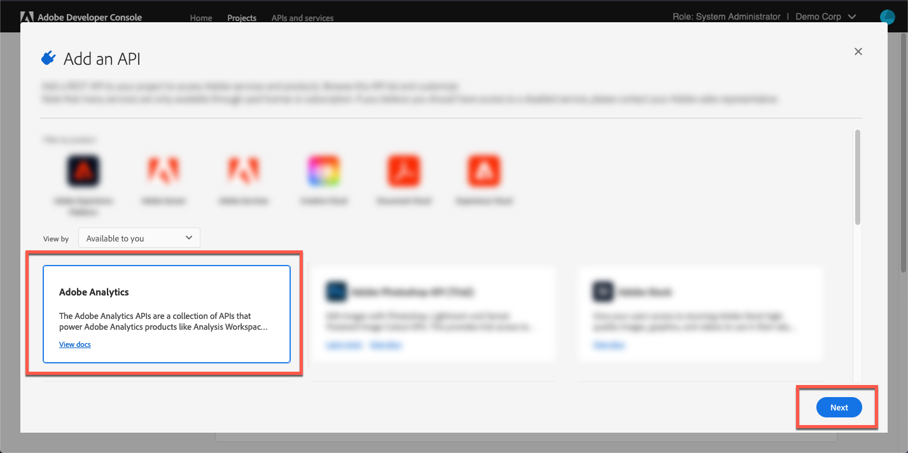

# Anmelden bei Adobe Analytics{#log-in-to-adobe-analytics}

Vergewissern Sie sich, dass Sie Mitglied der Zugriffsgruppe für Webdienste in Adobe Analytics sind. Tun Sie dies, bevor Sie sich anmelden, um Adobe Analytics-Berichte zu konfigurieren und Adobe Analytics-Berichtsvariablen mit Adobe Dynamic Media Classic-Ereignissen abzugleichen. Mitglieder dieser Gruppe können auf alle Berichte in den angegebenen Report Suites zugreifen. Verwenden Sie dazu die Web Services-API von Experience Cloud, unabhängig von den in der Benutzeroberfläche festgelegten Berechtigungen. Um ein Mitglied zur Gruppe hinzuzufügen, gehen Sie in Adobe Analytics zu **[!UICONTROL Admin Tools]** > **[!UICONTROL User Management]** > **[!UICONTROL Gruppen bearbeiten]**.

Bei der Anmeldung haben Sie die Möglichkeit, Ihre Experience Cloud-Organisations-ID einzugeben, um die neueste Videoanalyseimplementierung zu verwenden. Wenn Sie Ihre ID nicht eingeben möchten, funktioniert die Videoberichte weiterhin. Es kann jedoch dazu führen, dass die Daten nicht korrekt mit anderen Daten für diesen Client von außerhalb von Adobe Dynamic Media Classic integriert werden.

>[!NOTE]
>
>Wenn Ihr Adobe Analytics-Konto zur Anmeldung zur Adobe IMS-basierten Authentifizierung (Identity Management-System) migriert wurde, funktioniert die Eingabe der direkten Anmeldeinformationen nicht.

## Anmelden bei Adobe Analytics von Adobe Dynamic Media Classic aus {#log-in-to-analytics-from-dmc}

Integrieren Sie zunächst Dynamic Media Classic mit Adobe Analytics OAuth. Die Adobe Analytics OAuth-Integration mit Dynamic Media Classic erfolgt in der Regel nur einmal pro Benutzerin bzw. Benutzer.

1. Zugriff auf [Adobe Developer Console](https://developer.adobe.com/console). Stellen Sie sicher, dass Ihr Konto über Administratorberechtigungen für die Organisation verfügt, für die die Integration erforderlich ist.
1. Wählen Sie rechts oben auf der Startseite aus der Dropdown-Liste das entsprechende Unternehmen aus. (Der folgende Screenshot dient nur zu Informationszwecken. Der tatsächlich ausgewählte Firmenname kann variieren.)

   

1. Führen Sie einen der folgenden Schritte aus:

   * Klicken Sie oben auf der Seite auf der Registerkarte **[!UICONTROL Startseite]** auf **[!UICONTROL Neues Projekt erstellen]**.
   * Oben auf der Seite auf der Registerkarte **[!UICONTROL Projekte]**. Klicken Sie in der rechten Ecke der Seite auf **[!UICONTROL Neues Projekt erstellen]**.

1. Klicken Sie auf der Projektseite auf **[!UICONTROL API hinzufügen]**.
1. Wählen Sie auf der **[!UICONTROL API hinzufügen]** die Option **[!UICONTROL Adobe Analytics]** aus.
1. Klicken Sie unten rechts auf der Seite auf **[!UICONTROL Weiter]**.

   

1. Wählen Sie auf der Seite **[!UICONTROL `Configure API`]** die Option **[!UICONTROL USER AUTHENTICATION OAuth]** aus.
1. Klicken Sie unten rechts auf der Seite auf **[!UICONTROL Weiter]**.
1. Wählen Sie auf der Seite **[!UICONTROL `Configure API`]** die Option **[!UICONTROL OAUTH 2.0 Web]** aus.
1. Geben **[!UICONTROL im Textfeld]** Standard-Umleitungs-URI“ den folgenden Pfad genau wie folgt ein:

   `https://exploreadobe.com/dynamic-media-upgrade/`

1. Geben **[!UICONTROL im Textfeld]** Umleitungs-URI-Muster“ den folgenden Pfad genau wie abgebildet ein:

   `https://exploreadobe\.com/dynamic-media-upgrade/`

1. Klicken Sie unten rechts auf der Seite auf &quot;**[!UICONTROL API speichern]**.
1. Wählen Sie im Navigationsbereich links auf der Adobe Analytics-Seite unter **[!UICONTROL Anmeldedaten]** die Option **[!UICONTROL OAuth Web]** aus.
1. Gehen **[!UICONTROL unter &quot;]**&quot; wie folgt vor:
   * Wählen **[!UICONTROL unter]** Client-ID) die Option **[!UICONTROL Kopieren]** aus, um den Wert zu kopieren. Sie benötigen diesen Wert für die nachfolgende Analytics-Konfiguration in der Dynamic Media Classic-Desktop-Anwendung, die folgen soll.
   * Wählen **[!UICONTROL unter &quot;]**&quot; die Option **[!UICONTROL Client-Geheimnis abrufen]** aus, um den zugehörigen Wert anzuzeigen. Wählen Sie **[!UICONTROL Kopieren]** aus, um den Wert zu kopieren. Sie benötigen diesen Wert für die nachfolgende Adobe Analytics-Konfiguration in der Dynamic Media Classic-Desktop-Anwendung, die folgen soll.

## Konfigurieren von Adobe Analytics in Adobe Dynamic Media Classic {#configure-analytics-in-dmc}

>[!NOTE]
>
>Nach der Erstkonfiguration von Adobe Analytics in Dynamic Media Classic müssen Sie die Konfiguration in den folgenden Fällen nur noch wiederholen:
>
>* In Analytics wird ein neuer Bericht hinzugefügt, und der/die Benutzende möchte beginnen, Daten an diesen neuen Bericht zu senden.
>* Der Trackingserver wird in Adobe Analytics aktualisiert.
>* In einem Bericht wird eine neue Tracking-Variable eingeführt, und Sie möchten eine bestimmte Viewer-Variable in der Dynamic Media Classic-Benutzeroberfläche mit dieser neuen Analytics-Variablen verknüpfen.
>

1. Navigieren Sie oben rechts im Adobe Dynamic Media Classic-Desktop-Programm zu **[!UICONTROL Einstellungen]** > **[!UICONTROL Anwendungseinstellungen]**.
1. Wählen Sie im linken Bedienfeld unter **[!UICONTROL Anwendungseinstellungen]** die Option **[!UICONTROL Adobe Analytics]**.
1. Wählen Sie auf der Seite **[!UICONTROL Adobe Analytics]** Konfiguration&rbrace; **[!UICONTROL Adobe Analytics-Anmeldung]** aus.
1. Fügen Sie im Dialogfeld **[!UICONTROL Adobe Analytics]** im Feld **[!UICONTROL CLIENT-ID]** und im Feld **[!UICONTROL CLIENT-GEHEIMNIS]** die entsprechenden Werte ein, die Sie zuvor kopiert haben.
1. Wählen Sie unten rechts im Dialogfeld die Option **[!UICONTROL Anmelden]** aus und melden Sie sich bei Adobe IMS (Identity Management Services) an.

   Bei erfolgreicher Anmeldung wird das Adobe Analytics-Anmeldedialogfeld erneut zusammen mit der Dropdown-Liste **[!UICONTROL UNTERNEHMEN]** angezeigt, die von den für Sie verfügbaren Unternehmen initiiert wurde.

1. Wählen Sie aus **[!UICONTROL Dropdown]** Liste „UNTERNEHMEN“ ein Unternehmen aus.

   Wenn Sie ein Unternehmen auswählen, wird **[!UICONTROL Dropdown-Liste]** SUITES“ angezeigt, die von den für das ausgewählte Unternehmen verfügbaren Report Suites initiiert wurde.

1. Wählen Sie aus **[!UICONTROL Dropdown]** Liste „SUITES“ eine Report Suite aus.

   >[!NOTE]
   >
   >Standardmäßig müssen Benutzende beachten, dass die Dropdown-Listen **[!UICONTROL UNTERNEHMEN]** und **[!UICONTROL SUITES]** leer sind. Daher muss der Benutzer einen Wert aus jeder Liste auswählen.

1. Klicken Sie **[!UICONTROL OK]**, um die Konfiguration zu speichern.

   >[!NOTE]
   >
   >Das Feld **[!UICONTROL Adobe Analytics]** wird mit einem vorgeschlagenen Tracking-Server eines Drittanbieters ausgefüllt, der Ihrem Analytics-Namespace entspricht, wenn Sie auf **[!UICONTROL OK]** klicken. Wenn Sie einen anderen Tracking-Server verwenden, aktualisieren Sie ihn in diesem Feld, um Datenverlust zu vermeiden.

1. Klicken Sie unten links auf der Seite &quot;Adobe Analytics-Konfiguration“ auf **[!UICONTROL Speichern]** um sicherzustellen, dass die Adobe Analytics-Kontokonfiguration aktualisiert wird.

>[!MORELIKETHIS]
>
>* [Konfigurieren von Adobe Analytics-Berichten](configuring-analytics-reports.md#configuring_adobe_analytics_reports)
